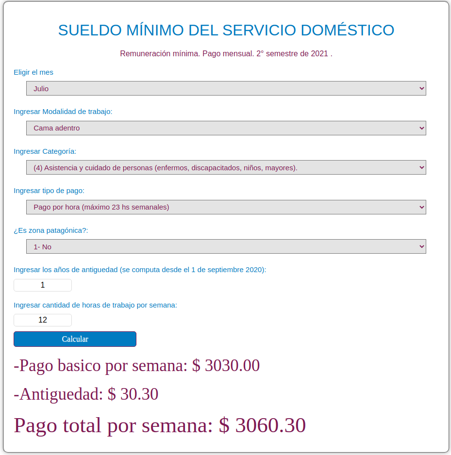

# Calculadora Servicio Doméstico

_Para leer en otros idiomas: [English](README.md), [Español](README.es.md)._

Esta es una simple calculadora hecha para el blog [Mi presupuesto familiar](https://www.presupuestofamiliar.com.ar/). Te dice cuanto tenés que pagar a tu empleada doméstica basado en la cantidad de horas que trabaja.

Para más información sobre cuanto hay que pagar, [mirá este artículo del blog](https://www.presupuestofamiliar.com.ar/empleada-domestica-este-es-el-sueldo-desde-noviembre-de-2021/).

Estoy hosteando esta calculadora en Github pages, podes probarla [acá](https://joaquinfeltes.github.io/Calculadora_servicio_domestico/).

### Un ejemplo de la calculadora en uso:

## 
